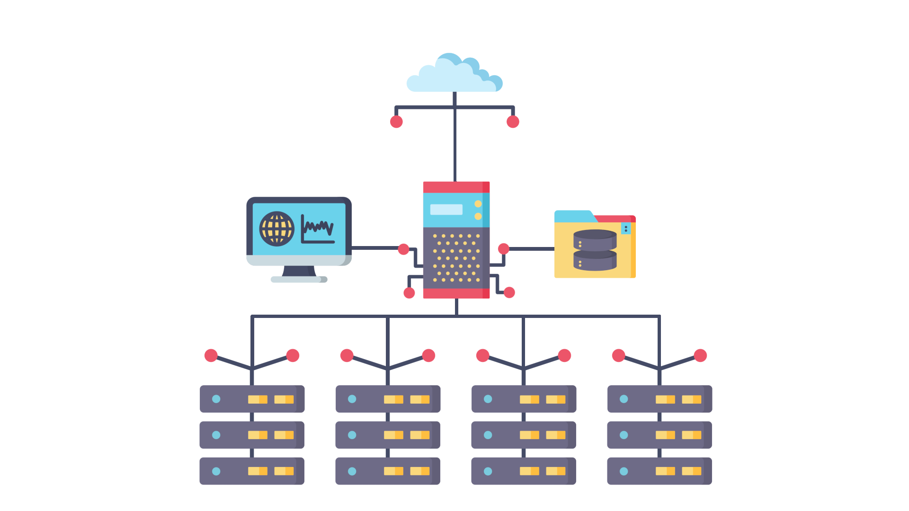

# master
Load Balancer for TS3AudioBot. Cluster the Bot over multiple hosts with no performance decrease.

## the idea
The main Idea behind this project is to cluster the Bot, so you have redundancy and more capacity without developing your own solution.

## How does it work?
This project has 2 nessesary parts, and one that is complety optional, but you might want to consider it.
As you can see in the image above, there is one main Router in the Network, which will just forward requests to the Bot on the least used Node in the Cluster. In the Admin Interface (resembled by the Monitor on the left side) you can configure each Node, add new ones and remove old ones. Data storage is persistence on the Main Router, so in case one of the nodes goes down, migrating the Bots to other Nodes should not be impossible. 

The Router pretty much replaces the Bots native API, so ideally you don't need to audjust any of your existing code. The API runs on the same Port as the Bot does by default (8180) and Authentication is handled the same way, with the only difference being, that you set a secret key in the Interface, which will be used instead of the token given from the Bot.

If you want, you can install our Monitoring Solution, which will give you more intel about CPU, RAM, Network usage and the amount of Bots that are running on each node. This can be beautiful paired with Grafana or any other service that uses Timeseries-based Databases. 

## Recommended Setup
First of all, if your server doesn't struggle with one Instance of the Bot running, you should not use this, because it comes with costs and work. Only continue if you really need this and your Host is under constant load and crashes from time to time.

You need one Router, which needs to be able to handle all the traffic of the requests towards the Bot (not audio traffic, since that does the Bot directly to the client, only client -> server is going through the proxy). On the Router also is the Managment Panel installed, where you will configure each Node. Also there is the need to have a MongoDB Database, since that is where all information about the Bots and Nodes is saved. There is no information on the Nodes. Make sure the System is powerful enought to handle all that!

The Nodes only run the TS3AudioBot itself. There is no additional Software required. Calculate the maximum amount of Bots that can run on one host (we've had 300 concurrent max. atm) and divide that by the amount of Bots you expect to have, that's the amount of Nodes you need in your cluster. 

Please be aware, that per Node you need to have a Bot connected to one Server, I recommend to use a TeamSpeak you own, or one specialy designed for Bots to just do nothing. 

## Security
having so many different servers that communicate with each other opens a lot of security risks. Since nearly every communication is over HTTP, you may consider using HTTPS with certificates from Let's Encrypt (a wildcard certificate should work perfectly if you assign each Node a sub-domain). Also please whitelist the Routers IP in the configurationfile of the Bot on the Node, so requests that are not coming from the Router will be ignored.  